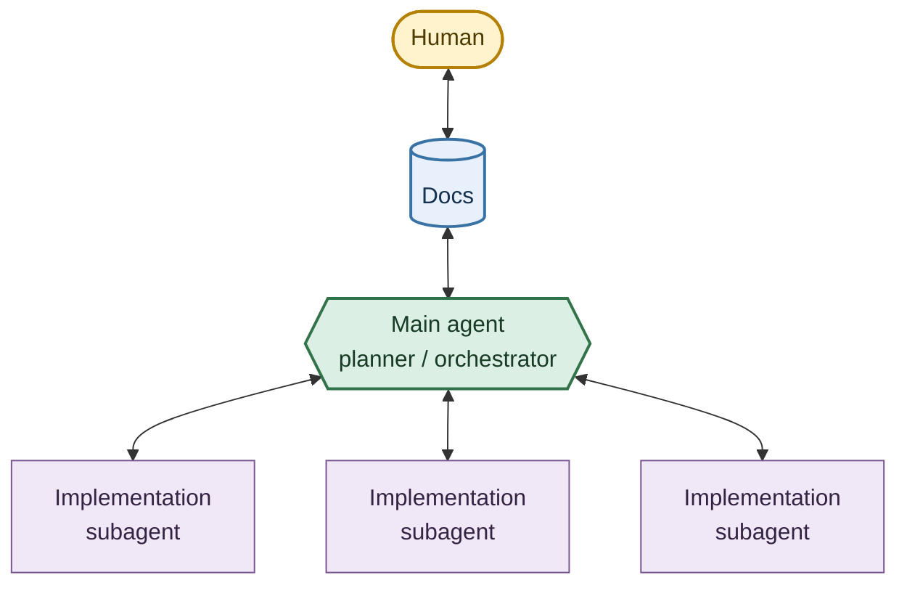

# Agentic Harness

A workflow for research coding agents: keep the human in the loop, spend tokens where they matter, and delegate the rest.

## Workflow

The harness organizes work as a human-guided planning loop with parallel execution:

- **Human**: sets goals, resolves decision forks, approves consequential choices.
- **Docs**: hold project context, workflows, constraints, and reusable skills.
- **Main agent**: plans, delegates, critiques, and consolidates. It does not implement.
- **Implementation subagents**: execute one narrow workstream each and return verifiable results.

The main agent runs four phases:

1. **Brainstorm.** Ideate with the user. Give critical feedback. Resolve forks before writing code. Converge on clear goals in a few turns.
2. **Plan.** Turn goals into a concrete implementation. State decisions directly. Break the work into bite-size, independently verifiable workstreams.
3. **Orchestrate.** Delegate each workstream to a subagent. Give it only the context it needs, verifiable success criteria, and a scope it cannot wander past. End each subagent on a synchronous check.
4. **Consolidate.** Review results against disk, not against reports. Take over what a subagent could not finish. Own all background work — SLURM jobs, servers, long runs — that subagents hand back.

## Principles

**Keep the user in the loop.** Research problems rarely have one correct workflow. They have a menu of best practices and tradeoffs. The main agent surfaces the decisions that matter, explains the options at the right level, and iterates before committing. The goal is informed delegation, not opaque automation.

**Spend a finite token budget well.** Running the best model at maximum effort on every task is not realistic. The harness approaches that quality for less by splitting a problem into small workstreams and handing them to cheaper models with just enough intelligence to succeed. The main agent reviews and consolidates.

**Manage abstraction.** Orchestration is information design. The user should get the right information, at the right level, in the right order — enough to decide, digestible enough to use. Delegation should cut cognitive load without hiding the assumptions, decisions, or evidence behind a result.

## Installation

This repository ships harness source files only. There are no install scripts — the installing agent owns environment-specific path selection.

The repository keeps vendor payloads separate:

- `claude/` — Claude Code instructions (`CLAUDE.md`), agents, and skills.
- `github-copilot/.github/` — GitHub Copilot and VS Code instructions (`copilot-instructions.md`), custom agents, and skills.

### For the installing agent

1. Inspect the target environment. Identify the active vendor and where it looks for global and project-local instructions, agents, and skills.
2. Ask the customer to choose scope:

   > Would you like the harness installed for this project only, or available user-wide? I recommend user-wide so the workflow is available across projects. Unless you choose project-only, I will install it user-wide and preserve any existing customizations.

   Default to user-wide. Use project-local only when asked.
3. Preserve existing files. Merge carefully when a target already exists, and explain any conflict before changing behavior.
4. Install the matching payload into the vendor's native locations:
   - Claude: `CLAUDE.md`, `agents/`, `skills/` from `claude/`.
   - Copilot: `copilot-instructions.md`, `agents/*.agent.md`, `skills/` from `github-copilot/.github/`.
5. For project-only installs, place files in the project root or config directory the vendor requires. Never copy user-wide files into unrelated projects.
6. Validate that the vendor discovers the instructions, agents, and skills. Run the narrowest available discovery check.
7. Report the selected scope, installed paths, preserved files, and validation result.
